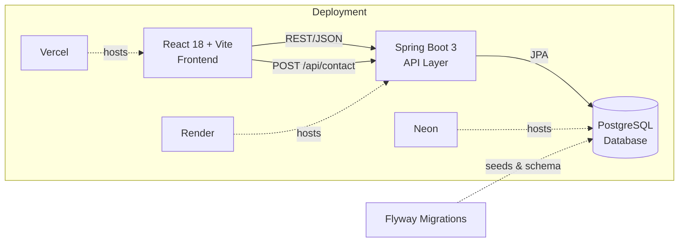

<div align="center">

# 🚀 Aryan Singh — Full-Stack Portfolio

**A real full-stack app, not just a static site.**
React frontend ⚡ Spring Boot REST API 🌱 PostgreSQL 🐘 — all containerized and free to deploy.

[](LICENSE)
[](https://www.oracle.com/java/)
[](https://spring.io/projects/spring-boot)
[](https://react.dev/)
[](https://vitejs.dev/)
[](https://www.postgresql.org/)
[](https://www.docker.com/)

</div>

---

### 📸 Preview

<div align="center">


<sub>Replace this with a real screenshot or a screen-recording GIF of the live site — drop the image in an `assets/` or `docs/` folder and update the path above.</sub>
</div>

---

## 📚 Table of Contents

- [Overview](#-overview)
- [Architecture](#-architecture)
- [Project Structure](#-project-structure)
- [Tech Stack](#️-tech-stack)
- [API Endpoints](#-api-endpoints)
- [Prerequisites](#-prerequisites)
- [Running Locally](#️-running-locally)
- [Deploying for Free](#️-deploying-for-free)
- [Dynamic vs Static Content](#-whats-dynamic-vs-static)
- [License](#-license)

---

## 🧭 Overview

This is a complete full-stack rebuild of my personal portfolio. Instead of hardcoded HTML, it's a **React** frontend talking to a real **Spring Boot REST API**, backed by **PostgreSQL**. Projects, skills, and certifications are stored in the database and served live — update the data without ever touching frontend code.

## 🏗️ Architecture



## 📁 Project Structure

```
portfolio-fullstack/
├── portfolio-backend/     🌱 Spring Boot 3 + PostgreSQL + Flyway REST API
├── portfolio-frontend/    ⚡ React 18 + Vite frontend
├── docker-compose.yml     🐳 Spins up Postgres + backend together for local dev
└── DEPLOYMENT_GUIDE.md    📘 Step-by-step free hosting walkthrough
```

## 🛠️ Tech Stack

| Layer      | Technology                                               |
|------------|-----------------------------------------------------------|
| 🎨 Frontend   | React 18, Vite, plain CSS (no framework lock-in)         |
| ⚙️ Backend    | Java 17, Spring Boot 3, Spring Data JPA, Bean Validation |
| 🗄️ Database   | PostgreSQL, schema + seed data via Flyway migrations     |
| 🔌 API        | REST endpoints (see below)                               |

## 📡 API Endpoints

| Method | Endpoint               | Description                     |
|--------|--------------------------|----------------------------------|
| `GET`  | `/api/projects`         | List all portfolio projects     |
| `GET`  | `/api/skills`           | List all skills                 |
| `GET`  | `/api/certifications`   | List all certifications         |
| `POST` | `/api/contact`          | Submit a contact form message   |

## ✅ Prerequisites

- ☕ Java 17+ and Maven *(or skip this — use the included `docker-compose.yml`, no local Java install needed)*
- 🟢 Node.js 18+ and npm
- 🐳 Docker + Docker Compose (recommended for local Postgres)

## ▶️ Running Locally

```bash
# 1. Start Postgres + backend together
docker compose up --build

# 2. In a second terminal, start the frontend
cd portfolio-frontend
cp .env.example .env    # VITE_API_BASE_URL=http://localhost:8080
npm install
npm run dev
```

Then open **http://localhost:5173** — the site loads with real project, skill, and certification data served live from the database, and the contact form persists submissions.

## ☁️ Deploying for Free

See **[DEPLOYMENT_GUIDE.md](DEPLOYMENT_GUIDE.md)** for a step-by-step walkthrough covering:

| Service  | Role              |
|----------|-------------------|
| 🐘 Neon   | Free hosted PostgreSQL |
| 🖥️ Render | Free backend hosting   |
| ▲ Vercel | Free frontend hosting  |

Plus CORS setup and common troubleshooting tips.

## 🔄 What's Dynamic vs. Static

- **🟢 Dynamic** (pulled from the database via the API): Projects, Skills, Certifications — update `V2__seed_data.sql` (or add a new Flyway migration) to change these without touching frontend code.
- **⚪ Static** (still plain React content): Experience and Education — these change far less often, but can be wired up to the API the same way if you want them dynamic too.

## 📄 License

MIT — see [LICENSE](LICENSE).

---

<div align="center">
<sub>Built with ☕, 🌱, and ⚛️ by <a href="https://github.com/datsaryan">Aryan Singh</a></sub>
</div>
